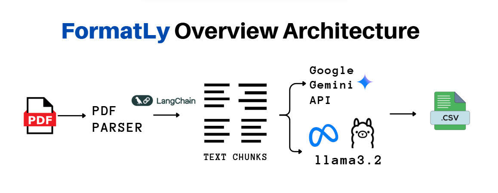
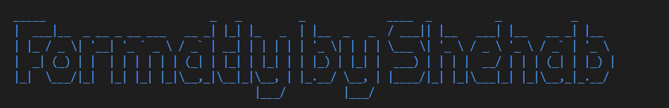
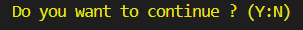

# FormatLy

FormatLy is an open-source tool for generating datasets with the preferred data formats tailored for fine-tuning large language models (LLMs) on domain-specific content.

Fine-tuning can be challenging when the required dataset is unavailable. FormatLy addresses this problem by enabling the creation of **Question–Response–Reasoning** datasets from any PDF source, making the fine-tuning process applicable in almost any domain.

Instead of relying solely on expensive API calls or powerful cloud GPUs, Formatly leverages lightweight local models (e.g., LLaMA 3.2) to generate high-quality training samples. This approach significantly reduces compute and API costs while maintaining dataset quality.

Formatly optimizes local machine performance by:

- Efficiently using available GPU and Optimizes CPU thread usage to avoid overloading the system during long runs.
- Applying a configurable cooldown to prevent hardware overheating
- Automatic and Fast extracting of semantically meaningful text chunks from PDFs using LangChain smart splitting
- Calculate and Estimate Precise time required for completing Dataset Generation

By default, Formatly generates Question–Answer–Explanation triplets for each text chunk, but supports multiple output formats for different fine-tuning frameworks.
<br>
<br>

## Supported Output Formats

- CSV (generic)
- Alpaca (Unsloth - llama3.2 - llama3.1)
- ShareGPT
- ChatML
<br>


## Architecture




The architecture includes:

- **PDF Parser** → Extracts and cleans raw text.
- **Smart Text Splitter** → Breaks content into logical, context-preserving chunks.
- **Model Interface** → Generates Q/A/Explanation using local or API-based models.
- **Dataset Formatter** → Saves in CSV, ChatML, Alpaca, or ShareGPT formats.
- **Fine-tuning Export** → Prepares ready-to-use datasets for cloud fine-tuning

<br>

## Installation


Install and Setup Ollama from [here](https://ollama.com/)

after ollama installation, in CMD run the following command (this will download the base model used in FormatLy architecture):

```
ollama run llama3.2
```

Clone the repository:

```
git clone https://github.com/ShehabMagdy101/Formatly.git
cd Formatly
```
Create and activate a virtual environment:

```powershell
python -m venv venv
venv\Scripts\activate
```

_if you faced a restriction error_:
```
python -m venv venv
Set-ExecutionPolicy Unrestricted -Scope Process
venv\Scripts\activate
```

Install dependencies:

```powershell
pip install -r requirements.txt
```
<br>

## How to Generate a Dataset using local model (`llama3.2`)


Go to folder `Formatly/src`:

```powershell
cd src
```

Get help command:

```
python main.py --help
```

Run the `main.py` with the path to your PDF and the prefered data format (default is CSV):

```
python main.py --pdf "path/to/your/document.pdf" --format csv
```


After generatating 10 data points Formalty will calculate the estimated time required to finish all generated data in minutes <br>
FormatLy will show you a sample text chunk for user review <br>
FormatLy will ask you if you want to continue or discard operation for more manual edits in `config.py`

)


after choosing to continue you should find the dataset generated saved in `Formatly/data/processed`
<br>
For more information and examples check `Docs`


